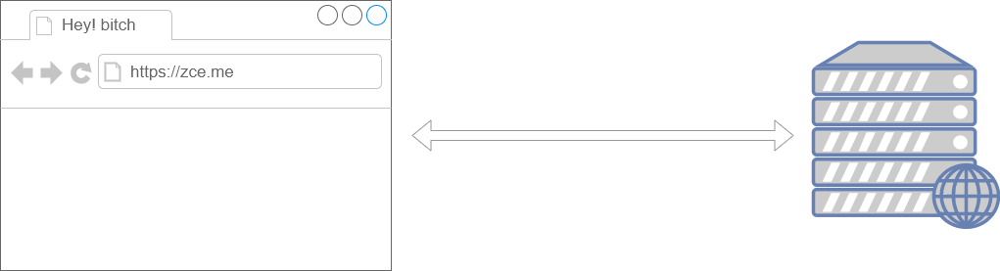

## 概述

> Web 程序最初的目的就是将信息（数据）放到公共的服务器，让所有网络用户都可以通过浏览器访问。



在此之前，我们可以通过以下几种方式让浏览器发出对服务端的请求，获得服务端的数据：

- 地址栏输入地址，回车，刷新
- 特定元素的 href 或 src 属性
- 表单提交

这些方案都是我们无法通过或者很难通过代码的方式进行编程，**如果我们可以通过 JavaScript 直接发送网络请求，那么 Web 的可能就会更多，随之能够实现的功能也会更多，至少不再是“单机游戏”。**

> 对 xxx 进行编程，指的就是用代码的方式操作它。

AJAX（Asynchronous JavaScript and XML），最早出现在 2005 年的 [Google Suggest](http://google-suggest.tumblr.com/)，是在浏览器端进行网络编程（发送请求、接收响应）的技术方案，它使我们可以通过 JavaScript 直接获取服务端最新的内容而不必重新加载页面。让 Web 更能接近桌面应用的用户体验。

说白了，**AJAX 就是浏览器提供的一套 API，可以通过 JavaScript 调用，从而实现通过代码控制请求与响应。实现网络编程。**

> 能力不够 API 凑。

## 快速上手

使用 AJAX 的过程可以类比平常我们访问网页过程

```javascript
// 1. 创建一个 XMLHttpRequest 类型的对象 —— 相当于打开了一个浏览器（用户代理）
var xhr = new XMLHttpRequest()

// 2. 打开与一个网址之间的连接 —— 相当于在地址栏输入访问地址
xhr.open('GET', 'http://.../time.php')

// 3. 通过连接发送一次请求 —— 相当于回车或者点击访问发送请求
xhr.send(null)

// 4. 指定 xhr 状态变化事件处理函数 —— 相当于处理网页呈现后的操作
xhr.onreadystatechange = function () {
    // 通过 xhr 的 readyState 判断此次请求的响应是否接收完成
    if (this.readyState === 4) {
        // 通过 xhr 的 responseText 获取到响应的响应体™
        console.log(this)
    }
}
```

### readyState

由于 `readystatechange` 事件是在 `xhr` 对象状态变化时触发（不单是得到响应时），也就是意味着这个事件会被触发多次，所以我们有必要了解每一个状态值的含义：

| readyState | 状态描述 | 说明 |
| ---------- | ------- | --- |
| 0          | UNSENT           | 代理（XHR）被创建，但尚未调用 `open()` 方法。             |
| 1          | OPENED           | `open()` 方法已经被调用，建立了连接。                     |
| 2          | HEADERS_RECEIVED | `send()` 方法已经被调用，并且已经可以获取状态行和响应头。 |
| 3          | LOADING          | 响应体下载中， `responseText` 属性可能已经包含部分数据。  |
| 4          | DONE             | 响应体下载完成，可以直接使用 `responseText`。             |

#### 时间轴

```flow
s=>start: UNSENT
o1=>operation: OPENED
o2=>operation: HEADERS_RECEIVED
o3=>operation: LOADING
e=>end: DONE

s(right)->o1(right)->o2(right)->o3(right)->e
```

```flow
s=>start: 初始化
o1=>operation: 建立连接
o2=>operation: 接收到响应头
o3=>operation: 响应体加载中
e=>end: 加载完成

s(right)->o1(right)->o2(right)->o3(right)->e
```

``` js
var xhr = new XMLHttpRequest();
// 代理（XHR）被创建，但尚未调用 open() 方法。
console.log(xhr.readyState);
// => 0

xhr.open('GET', './time.php');

// open() 方法已经被调用，建立了连接。
console.log(xhr.readyState)
// => 1

xhr.send(null);

xhr.onreadystatechange = funciton() {
    console.log(this.readyState);
    // send() 方法已经被调用，并且已经可以获取状态行和响应头。
    // => 2
    // 响应体下载中，responseText 属性可能已经包含部分数据。
    // => 3
    // 响应体下载完成，可以直接使用 responseText。
    // => 4
}
```

通过理解每一个状态值的含义得出一个结论：一般我们都是在 `readyState` 值为`4`时，执行响应的后续逻辑。

``` js
xhr.onreadystatechange = function() {
    switch(this.readyState) {
        case 2:
        	// 开始下载
        	// 拿到整个报文头
        	console.log(this.getAllResponseHeaders().split('\n'));

        	// 拿到报文头里子项server
        	console.log(this.getResponseHeader('server'));

        	// 还没拿到报文体
        	console.log(this.responseText);

        	break
        case 3:
        	// 下载中
        	console.log(this.responseText);
        	break
        case 4:
        	// 下载完成
        	console.log(this.responseText);
        	break
    }
}
```

**提示**

> 尽量少用 `on` 来写事件，多用 `addEventListener` 来替代

``` js
xhr.addEventListener('readystatechange', function(){
    if(this.readyState !== 4) return;
 	// 后续代码
});
```

XMLHttpRequest 2.0新增内容：onload / on progress

html5： xhr.onload 相当于 xhr.onreadystatechange 为4 的时候 

HTML5 中对 XMLHttpRequest 类型全面升级，更易用，更强大

``` js
const xhr = new XMLHttpRequest();
xhr.open('GET', './time.php');
xhr.onload = ()=>{}
xhr.onprogress = ()=>{}
xhr.send(null);
```

### 遵循 HTTP

本质上 XMLHttpRequest 就是 js 在 web 平台中发送 HTTP 请求的手段，所以我们发送出去的请求仍然是 HTTP 请求，同样符合 HTTP 约定的格式：

``` js
var xhr = new XMLHttpRequest()

// 设置请求报文的请求行
xhr.open('GET', './time.php')

// 设置请求头
xhr.setRequestHeader('Accept', 'text/plain')

// 设置请求体
xhr.send(null)

xhr.onreadystatechange = function () {
    if (this.readyState === 4) {
        // 获取响应状态码
        console.log(this.status)
        // 获取响应状态描述
        console.log(this.statusText)
        // 获取响应头信息
        console.log(this.getResponseHeader('Content-Type')) // 指定响应头
        console.log(this.getAllResponseHeaders()) // 全部响应头
        // 获取响应体
        console.log(this.responseText) // 文本形式
        console.log(this.responseXML) // XML 形式，了解即可不用了
    }
}
```

> 参考链接：
>
> - https://developer.mozilla.org/zh-CN/docs/Web/API/XMLHttpRequest
> - https://developer.mozilla.org/zh-CN/docs/Web/API/XMLHttpRequest/Using_XMLHttpRequest

## 具体用法

### GET 请求

> 通常在一次 GET 请求过程中，参数传递都是通过 URL 地址中的 `？` 参数传递

``` js
var xhr = new XMLHttpRequest()
// GET 请求传递参数通常使用的是问号传参
// 这里可以在请求地址后面加上参数，从而传递数据到服务端
xhr.open('GET', './delete.php?id=1')
// 一般在 GET 请求时无需设置响应体，可以传 null 或者干脆不传
xhr.send(null)
xhr.onreadystatechange = function () {
    if (this.readyState === 4) {
        console.log(this.responseText)
    }
}

// 一般情况下 URL 传递的都是参数性质的数据，而 POST 一般都是业务数据
```

### POST 请求

> POST 请求过程中，都是采用请求体承载需要提交的数据

``` js
var xhr = new XMLHttpRequest();
// open 方法的第一个参数的作用就是设置请求的 method
xhr.open('POST', './add.php');
// 设置请求头中的 Content-Type 为 application/x-www/form-urlencoded
// 标识此次请求的请求体格式为 urlencoded 以便于服务端接收数据
xhr.setRequestHeader('Content-Type', 'application/x-www-form-urlencoded');
// 需要提交到服务端的数据可以通过 send 方法的参数传递
// 格式：key1=value1&key2=value2
xhr.send('key1=value1&key2=value2');
xhr.onreadystatechange = function(){
    if(this.readyState === 4) {
        console.log(this.responseText);
    }
}
```

### 同步与异步

关于同步与异步的概念的生活中很多常见的场景，举例说明。

> 同步：一个人在同一个时刻只能做一件事情，在执行一些耗时的操作不去做别的事，只是等待
>
> 异步：在执行一些耗时的操作的同时去做别的事，而不是等待

`xhr.open()` 方法第三个参数要求传入的是一个 `bool` 值，其作用就是设置此次请求是否采用异步方式执行，默认是 `true`，如果需要同步执行可以通过传递`false`实现：

``` js
console.log('before ajax');
var xhr = new XMLHttpRequest();
// 默认第三个参数为 true 意味着采用异步方式执行
xhr.open('GET', './time.php', true);
xhr.send(null);
xhr.onreadystatechange = function(){
    if(this.readyState === 4) {
        // 这里的代码最后执行
        console.log('request done');
    }
}
console.log('after ajax');

/* 
before ajax
after ajax
request done
*/
```

如果采用同步方式执行，则代码会卡死在`xhr.send()`这一步：

``` js
console.log('before ajax');
var xhr = new XMLHttpRequest();
// 同步方式
xhr.open('GET', './time.php', false);
// 同步方式 执行需要 先注册事件仔调用 send，否则 readystatechange 无法触发
xhr.onreadystatechange = function(){
    if(this.readState === 4) {
        // 这里的代码最后执行
        console.log('request done');
    }
}
xhr.send(null);
console.log('after ajax');
```

演示同步异步差异。

一定在发送请求 `send()` 之前注册 `readystatechange` （不管同步或者异步）

- 为了让这个事件可以更加可靠（一定触发），一定是先注册

了解同步模式即可，切记不要使用同步模式。

至此，我们已经大致了解了 ajax 的基本 API。

### XMLHttpRequest API 总结

#### 属性

- `readyState`
- `status`
- `responseText`
- `responseXML`
- `onreadystatechange`

#### 方法

- `open(methon, url, async)`
- `send(requestBody)`
- `setRequestHeader(key, value)`
- `getResponseHeader(key)`

**response跟responseText的区别**

例如：
``` js
var xhr = new XMLHttpRequest();
xhr.open('GET', './test.php');
xhr.send();
// 我们通过代码告诉请求代理对象，服务端响应给我们的是JSON
xhr.responseType = 'json';
xhr.onreadystatechange = function(){
    if(this.readyState !== 4) return;
    console.log(this)
    // this.response 获取到的结果会根据 this.responseType 的变化而变化
    // this.responseText 永远获取的是字符串形式的响应体
}
```

> 参考: https://developer.mozilla.org/en-US/docs/Web/API/XMLHttpRequest/responseType

### 响应数据格式

> 提问：如果希望服务端返回一个复杂数据，该如何处理？

关心的问题就是服务端发出何种格式的数据，这种格式如何在客户端用 js 解析。

#### XML

一种数据描述手段

``` js
if(this.readyState !== 4) return;
// this.responseXML 专门用来获取服务端返回的XML数据，操作方式就是通过DOM的方式操作
// 但是需要服务端响应头中的 Content-Type 必须是 application/xml
console.log(this.responseXML.documentElement.children[0].innerHTML);
console.log(this.responseXML.documentElement.getElementsByTagName('name')));
```

老掉牙的东西，简单演示一下，不在这里浪费时间，基本现在的项目不用了。

淘汰的原因：数据冗余太多

#### JSON

也是一种数据描述手段，类似于 js 字面量方式


服务端采用 JSON 格式返回数据，客户端按照 JSON 格式解析数据

> **注意**
>
> - 不管是 JSON 也好，还是 XML，只是在 AJAX 请求过程中用到，并不代表它们之间有必然的联系，它们只是数据协议罢了
> - 不管服务端是采用 XML 还是采用 JSON 本质上都是将数据返回给客户端
> - 服务端应该根据响应内容的格式设置一个合理的 Content-Type

### 留言板案例

1. 页面结构
2. 数据接口
3. AJAX 实现

### 处理响应数据渲染

客户端中拿到请求的数据之后最常见的就是把这些数据呈现到页面上。

如果数据结构简单，可以直接通过字符串操作(拼接)的方式处理，但是如果数据过于复杂，字符串拼接维护成本太大，就不推荐了

> 模板引擎：
>
> - artTemplate: https://aui/github.io/art-template/

模板引擎实际上就是一个 API，模板引擎有很多种，使用方式大同小异，目的为了可以更容易的将数据渲染到HTML中

### 缓存问题

``` js
var xhr = new XMLHttpRequest()
xhr.open('GET', '/time')
xhr.send(null)
xhr.onreadystatechange = function () {
    if (this.readyState !== 4) return
    console.log(this.responseText)
    // => 每次得到的结果都是相同的
}
```

#### 解决方案

##### URL 加戳

这个办法的核心就是让浏览器认为每次请求的地址都不同

> 不同的 querystring 会被浏览器认为是不同的地址，浏览器会忽略客户端缓存

``` js
var xhr = new XMLHttpRequest()
xhr.open('GET', '/time?t=' + Date.now())
xhr.send(null)
xhr.onreadystatechange = function () {
    if (this.readyState !== 4) return
    console.log(this.responseText)
    // =>
}
`
```

##### *服务端设置响应头

由于服务端 通过 HTTP 响应报文中的响应头会告知客户端浏览器不要缓存当前地址

``` js
app.get('/time', (req, res) => {
    res.set('Cache-Control', 'no-cache')
    res.set('Pragma', 'no-cache')
    res.set('Expires', '-1')
    res.send(Date.now().toString())
})
```

了解即可，更多的情况下前端开发中还是通过加戳的方式解决此问题，因为在前端可控范围之内

### 兼容方案

XMLHttpRequest 在老版本浏览器（IE5/6）中有兼容问题，可以通过另外一种方式代替

``` js
var xhr = XMLHttpRequest ? new XMLHttpRequest() : new ActiveXObject('Microsoft.XMLHTTP')
```

## 封装

### AJAX 请求封装

> 函数就可以理解为一个想要做的事情，函数体中约定了这件事情做的过程，直到调用时才开始工作。

```javascript
/**
 * 发送一个 AJAX 请求
 * @param  {String}   method 请求方法
 * @param  {String}   url    请求地址
 * @param  {Object}   params 请求参数
 * @param  {Function} done   请求完成过后需要做的事情（委托/回调）
 */
function ajax (method, url, params, done) {
    // 统一转换为大写便于后续判断
    method = method.toUpperCase()

    // 对象形式的参数转换为 urlencoded 格式
    var pairs = []
    for (var key in params) {
    	pairs.push(key + '=' + params[key])
    }
    var querystring = pairs.join('&')

    var xhr = window.XMLHttpRequest ? new XMLHttpRequest() : new ActiveXObject('Microsoft.XMLHTTP')

    xhr.addEventListener('readystatechange', function () {
    	if (this.readyState !== 4) return

    	// 尝试通过 JSON 格式解析响应体
    	try {
     	 	done(JSON.parse(this.responseText))
    	} catch (e) {
      		done(this.responseText)
    	}
    })

    // 如果是 GET 请求就设置 URL 地址 问号参数
    if (method === 'GET') {
    	url += '?' + querystring
    }

    xhr.open(method, url)

    // 如果是 POST 请求就设置请求体
    var data = null
    if (method === 'POST') {
    	xhr.setRequestHeader('Content-Type', 'application/x-www-form-urlencoded')
    	data = querystring
    }
    xhr.send(data)
}

// 调用
ajax('get', '/getsomthing', { id: 123 }, function (data) {
    console.log(data)
})

ajax('post', '/addsomthing', { foo: 'posted data' }, function (data) {
    console.log(data)
})
```

> **委托**：将函数作为参数传递就像是将一个事情交给别人，这就是委托的概念

### jQuery.ajax

jQuery 中有一套专门针对 AJAX 的封装，功能十分完善，经常使用，需要着重注意。

> 一个你会用我会用他会用到的点，就一定有一个已经封装好的

> 参考：
> - http://www.jquery123.com/category/ajax/
> - http://www.w3school.com.cn/jquery/jquery_ref_ajax.asp

#### $.ajax

``` js
$.ajax({
    url: '/time',
    type: 'get',
    dataType: 'json',
    data: { id: 1 },
    beforeSend: function (xhr) {
        console.log('before send')
    },
    success: function (res) {
        console.log(res)
    },
    error: function (xhr) {
        console.log(xhr)
    },
    complete: function (xhr) {
        console.log('request completed')
    }
})
```

常用选项参数介绍：

- url：请求地址
- type：请求方法，默认为 `get`
- dataType：服务端响应数据类型
- contentType：请求体内容类型，默认 `application/x-www-form-urlencoded`
- data：需要传递到服务端的数据，如果 GET 则通过 URL 传递，如果 POST 则通过请求体传递
- timeout：请求超时时间
- beforeSend：请求发起之前触发
- success：请求成功之后触发（响应状态码 200）
- error：请求失败触发
- complete：请求完成触发（不管成功与否）


#### $.get

GET 请求快捷方法

`$.get(url, data, callback)`

#### $.post

POST 请求快捷方法

`$.post(url, data, callback)`

#### 全局事件处理

> http://www.jquery123.com/category/ajax/global-ajax-event-handlers/

#### 自学内容（作业）

- `$(selector).load()`
- `$.getJSON()`
- `$.getScript()`

简单概括以上方法的作用和基本用法。

> 附：顶部进度条 NProgress 显示加载进度 https://ricostacruz.com/nprogress

### Axios

Axios 是目前应用最为广泛的 AJAX 封装库，相对于 jQuery 的优势在于功能能强劲，职责更单一，后期专门有介绍。

``` javascript
axios.get('/time')
	.then(function (res) {
    	console.log(res.data)
	})
	.catch(function (err) {
		console.error(err)
	})
```

> *扩展： https://github.com/axios/axios

## 跨域

### 相关概念

同源策略是浏览器的一种安全策略，所谓同源是指**域名**，**协议**，**端口**完全相同，只有同源的地址才可以相互通过 AJAX 的方式请求。

同源或者不同源说的是两个地址之间的关系，不同源地址之间请求我们称之为**跨域请求**

什么是同源？例如：http://www.example.com/detail.html 与一下地址对比

| 对比地址                                   | 是否同源 | 原因      |
| ---------------------------------------- | ------ | ------- |
| https://www.example.com/detail.html      | 不同源  | 协议不同    |
| http://api.example.com/detail.html       | 不同源  | 域名不同    |
| http://www.example.com:8080/detail.html  | 不同源  | 端口不同    |
| http://api.example.com:8080/detail.html  | 不同源  | 域名、端口不同 |
| https://api.example.com/detail.html      | 不同源  | 协议、域名不同 |
| https://www.example.com:8080/detail.html | 不同源  | 端口、协议不同 |
| http://www.example.com/other.html        | 同源    | 只是目录不同  |

### 解决方案

现代化的 Web 应用中肯定会有不同源的现象，所以必然要解决这个问题，从而实现跨域请求。

> 参考：http://rickgray.me/solutions-to-cross-domain-in-browser

#### JSONP

**JSON** with **P**adding，是一种借助于 `script` 标签发送跨域请求的技巧。

其原理就是在客户端借助 `script` 标签请求服务端的一个地址，服务端的这个地址返回一段带有调用某个全局函数调用的 JavaScript 脚本（而非一段 HTML），将原本需要返回给客户端的数据通过参数传递给这个函数，函数中就可以得到原本服务端想要返回的数据。

``` js
function jsonp (url, params, callback) {
    var funcName = 'jsonp_' + Date.now() + Math.random().toString().substr(2, 5);

    if(typeof params === 'object') {
        var tempArr = [];
        for(var key in params) {
            var value = params[key];
            tempArr.push(key + '=' + value);
        }
        params = tempArr.join('&');
    }

    var script = document.createElement('script');
    script.src = url + '?' + params + '&callback=' + funcName;
    document.body.appendChild(script);

    window[funcName] = function(data) {
        callback(data);

        delete window[funcName];
        document.body.removeChild(script);
    }
}
```

``` js
jsonp('http://localhost/jsonp/server.php', {id: 123}, function(res) {
    console.log(res);
});
```

以后绝大多数情况都是采用 JSONP 的手段完成不同源地址之间的跨域请求

客户端 http://www.zce.me/users-list.html

```html
<script src="http://api.zce.me/users?callback=foo"></script>
```

服务端 http://api.zce.me/users?callback=foo 返回的结果

```javascript
foo(['我', '是', '你', '原', '本', '需', '要', '直', '接', '返', '回', '的', '数', '据'])
```

**总结一下**：由于 XMLHttpRequest 无法发送不同源地址之间的跨域请求，所以我们必须要另寻他法，script 这种方案就是我们最终选择的方式，我们把这种方式称之为 JSONP，如果你不了解原理，先记住怎么用，多用一段时间再来看原理。

问题：

1. JSONP 需要服务端配合，服务端按照客户端的要求返回一段 JavaScript 调用客户端的函数
2. 只能发送 GET 请求

> 注意：JSONP 用的是 script 标签，跟 AJAX 提供的 XMLHttpRequest 没有任何关系！！！

##### jQuery 中对 JSONP 的支持

jQuery 中使用 JSONP 就是将 dataType 设置为 jsonp

```javascript
$.ajax({
	url: 'https://douban.uieee.com/v2/movie/coming_soon',
	type: 'get',
	dataType: 'jsonp',
	data: { id: 1 },
	beforeSend: function (xhr) {
		console.log('before send')
	},
	success: function (data) {
		console.log(data)
	},
	error: function (xhr) {
		console.log(xhr)
	},
	complete: function (xhr) {
		console.log('request completed')
	}
})
```

> Axios 由于设计原因不支持 JSONP

#### CORS

Cross Origin Resource Share，跨域资源共享

```javascript
app.get('/time', (req, res) => {
	// // 允许任意源访问，不安全
	// res.set('Access-Control-Allow-Origin', '*')
	// 允许指定源访问
	res.set('Access-Control-Allow-Origin', 'http://zce.me')
	res.send(Date.now().toString())
})
```

这种方案无需客户端作出任何变化（客户端不用改代码），只是在被请求的服务端响应的时候添加一个 `Access-Control-Allow-Origin` 的响应头，表示这个资源是否允许指定域请求。

> https://developer.mozilla.org/zh-CN/docs/Web/HTTP/Access_control_CORS

## XMLHttpRequest 2.0

> 暂作了解，无需着重看待

HTML5 中对 XMLHttpRequest 类型全面升级，更易用，更强大

### onload / onprogress

```javascript
var xhr = new XMLHttpRequest()
xhr.open('GET', '/time')
xhr.onload = function () {
	// onload readyState => 4
	// 只在请求完成时触发
	console.log(this.readyState)
}
xhr.onprogress = function (e) {
	// onprogress readyState => 3
	// 只在请求进行中触发
	console.log(this.readyState)
	// e.loaded  在周期性调用中接受到了多少信息。
	// e.total  该请求一共有多少信息。
}
xhr.send(null)
```

> - https://developer.mozilla.org/zh-CN/docs/Web/API/XMLHttpRequestEventTarget/onload
> - https://developer.mozilla.org/zh-CN/docs/Web/API/XMLHttpRequestEventTarget/onprogress

### response 属性

以对象的形式表述响应体，其类型取决于 `responseType` 的值。你可以尝试设置 `responseType` 的值，以便通过特定的类型请求数据。

```javascript
var xhr = new XMLHttpRequest()
xhr.open('GET', '/api/users')
// 主观认为服务端返回的响应体为 JSON 格式
xhr.responseType = 'json'
xhr.onload = function () {
	console.log(this.response)
	// => Array 而不是 JSON String
}
xhr.send(null)
```

> `responseType` 要在调用 `open()` 初始化请求之后，在调用 `send()` 发送请求到服务器之前设置方可生效。

| 值 | 描述 |
| --- | --- |
| "" | 将 responseType 设为空字符串与设置为"text"相同， 是默认类型 （实际上是 DOMString）。|
| "arraybuffer" | response 是一个包含二进制数据的 JavaScript ArrayBuffer 。|
| "blob" | response 是一个包含二进制数据的 Blob 对象 。|
| "document" | response 是一个 HTML Document 或 XML XMLDocument ，这取决于接收到的数据的 MIME 类型。请参阅 HTML in XMLHttpRequest 以了解使用 XHR 获取 HTML 内容的更多信息。|
| "json" | response 是一个 JavaScript 对象。这个对象是通过将接收到的数据类型视为 JSON 解析得到的。|
| "text" | response 是包含在 DOMString 对象中的文本。|

### FormData

以前 AJAX 操作只能提交字符串，现在可以提交 **二进制** 的数据。

```javascript
var formElement = document.querySelector('form#login')

// 表单数据对象
var data = new FormData(formElement)
// 额外文本内容
data.append('key', 'value')
// 额外文件内容
data.append('file', dom.files[0])

var xhr = new XMLHttpRequest()
xhr.open('POST', '/api/users')
xhr.send(data)
xhr.onload = function () {
	console.log(this.responseText)
}
```

> https://developer.mozilla.org/zh-CN/docs/Web/API/FormData

### 案例

异步上传文件

## 参考链接

- http://www.w3school.com.cn/ajax/index.asp
- https://aui.github.io/art-template/zh-cn

## 学习目标

- Ajax
  - 能够概述什么是Ajax
  - 能够理解传统模式交互和Ajax模式交互的异同

- 原生 XHR
  - 能够掌握使用原生 XHR 发起 GET 请求
  - 能够掌握使用原生 XHR 发起 POST 请求
  - 能够理解 GET 请求与 POST 请求的区别
  - 能够理解同步请求和异步请求的差异
  - 能够理解什么是 GET 缓存
  - 能够掌握让 GET 缓存失效的解决方法
- JSON
  - 能够理解并概述什么是 JSON
  - 能够掌握将 JSON 格式字符串转换为 JavaScript 对象
  - 能够掌握将 JavaScript 对象转换为 JSON 格式字符串
- 客户端模板引擎
  - 能够理解模板引擎的本质作用
  - 能够理解模板引擎的实现原理
  - 能够掌握使用模板引擎将请求响应数据渲染到页面中
- 封装 Ajax
  - 能够掌握 GET 请求方法的封装
  - 能够掌握 POST 请求方法的封装
  - 能够掌握 GET+POST 请求方法的封装
  - 能够理解在异步操作中回调函数的意义

- jQuery 中的 Ajax
  - 能够掌握 $.ajax 的使用
  - 能够掌握 $.get 的使用
  - 能够掌握 $.post 的使用
- XHR 2.0
  - 能够掌握 FormData 对象的使用
  - 能够掌握使用 XHR 2.0 异步上传文件
  - 能够掌握使用 XHR 2.0 实现文件上传进度条
- 跨域
  - 能够理解什么是 Ajax 跨域
  - 能够理解什么是同源策略
  - 能够掌握使用 CORS 的方式进行跨域操作
  - 能够掌握使用 JSONP 的方式进行跨域操作
  - 能够理解 JSONP 跨域操作原理
  - 能够掌握 jQuery 中的 ajax 通过 JSONP 进行跨域操作

