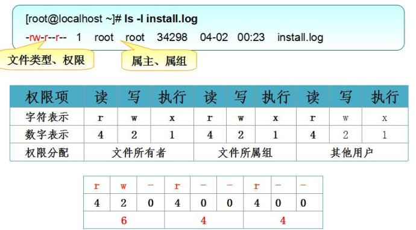

title: fs模块.md
date: 2018-06-04 14:15:00
category: Node
tags: fs

---

fs 基础用法 API [fs模块API](www.nodejs.cn/api/)
常用的30个左右

* fs.readFile
* fs.writeFile
* fs.copyFile

控制文件读取
* fs.read
* fs.write
* fs.open
* fs.fsync
* fs.close

文件夹操作
* fs.mkdir
* fs.rmdir
* fs.rname
* fs.readdir
* fs.stats

**二爷一只死读书**


---


* 读取文件
    fs.readFile(path[, options], callback) // 异步
    fs.readFileSync(path[, options]) // 同步

* 写入文件
    fs.writeFile(file, data[, options], callback) // 异步写入
    fs.writeFileSync(file, data[, options]) // 同步

* 追加文件
    fs.appendFile(file, data[, options], callback)


## 1. fs模块

* 在Node.js中，使用fs模块来实现所有有关文件及目录的创建、写入及删除操作。
* 在fs模块中，所有的方法都分为同步和异步两种实现。
* 具有 `sync` 后缀的方法为同步方法， 不具有 `sync` 后缀的方法为异步方法。

## 2. 整体读取文件

    fs.readFile(path[, options], callback) // 异步读取

    * options
        * encoding
        * flag 默认 'r'

    fs.readFileSync(path[, options]) // 同步读取

## 3. 写入文件

### 3.1 异步写入

    fs.writeFile(file, data[, options], callback)

    options
        * encding
        * flag 默认 'w'
        * mode 读写权限 默认 0666

```js
let fs = require('fs');
fs.writeFile('./1.txt', Date.now()+'\n', {flag: 'a'}, function(){
    console.log('ok');
});
```

### 3.2 同步写入

    fs.writeFileSync(file, data[, options])

### 3.3 追加文件

    fs.appendFile(file, data[, options], callback)

``` js
fs.appendFile('./1.txt', Date.now()+'\n', funciton(){
    console.log('ok');
});
```

### 3.4 拷贝文件

``` js
function copy(src, target){
    fs.readFile(src, function(err, data){
        fs.writeFile(target, data);
    })
}
```

## 4. 从指定位置处开始读取文件

### 4.1 打开文件

    fs.open(filename, flags, [mode], callback)

```js
fs.open('1.txt', 'r', 0600, funciton(err, fd){});
```

    * fd(FileDescriptor)文件描述符
    * in -- 标准输入(键盘)的描述符
    * out -- 标准输出(屏幕)的描述符
    * err -- 标准错误输出(屏幕)的描述符

### 4.2 读取文件

    fs.read(fd, buff, offset, length, position, callback((err, bytesRead, buffer)))

``` js
// fs.readFile
let fs = require('fs');
// error-first 错误第一
fs.readFile('./1.txt',{encoding:'utf8',flag:'r',},function (err,data) {
  // if(err) return console.log(err);
  if(err) throw err;
  console.log(data);
});
// fs.writeFile
// 文件中存的永远是二进制 0o666 标识可读 可写
fs.writeFile('./2.txt',Buffer.from('123'),{flag:'a',mode:0o666},function () {
  console.log('写入成功')
})
// fs.copyFile
fs.copyFile('1.txt','3.txt',function () {
  console.log('拷贝成功')
});

// 如果要实现拷贝大文件 以上的操作都会造成内存过大情况
// fs.read
/*
    fd 代表的是文件描述符 符号是从3开始
    0 代表的是标准输入 process.stdin
    1 标准输出 process.stdout
    2 代表的是错误输出 process.stderr
*/
fs.open('./1.txt','r',function (err,fd) {
  // 把文件中的内容读取到内存中
  let BUFFER_SIZE = 3
  let buffer = Buffer.alloc(BUFFER_SIZE);
  // fd藐视符 buffer是读取到哪个buffer上 offsetbuffer的偏移量
  // byteRead实际读到的个数
  let index = 0;
  function next() {
    // 每次读取三个 ，如果读取的等于三个默认认为还有数据 ，否则就认为读取完毕了
    fs.read(fd, buffer, 0, BUFFER_SIZE, index, function (err, byteRead) {
      index+=byteRead
      console.log(buffer.slice(0,byteRead).toString());
      if (byteRead === BUFFER_SIZE){
        next();
      }else{
        fs.close(fd,()=>{console.log('close')});
      }
    })
  }
  next();
});

```

### 4.3 写入文件

    fs.write(fd, buffer[, offset[, length[, position]]], callback)

### 4.4 关闭文件

    fs.close(fd, [callback])

### 4.5 同步磁盘缓存

    fs.fsync(fd, [callback])

```js
let buf = Buffer.from('珠峰培训');
fs.open('./2.txt', 'w', function (err, fd) {
  fs.write(fd, buf, 3, 6, 0, function (err, written, buffer) {
    console.log(written);
    fs.fsync(fd, function (err) {
      fs.close(fd, function (err) {
          console.log('写入完毕!')
        }
      );
    });
  })
});

```

### 4.6 拷贝文件

```js
// 节约内存的copy 流 pipe ***
function copy(source,target){
  let BUFFER_SIZE = 3;
  let buffer = Buffer.alloc(BUFFER_SIZE);
  let index = 0;
  fs.open(source,'r',function (err,rfd) { // 开启读取的文件描述符
    if(err) return console.log(err);
    fs.open(target, 'w', 0o666, function (err, wfd) { // 开启写入的文件描述符
      function next() {
        fs.read(rfd, buffer, 0, BUFFER_SIZE, index, function (err, bytesRead) {
          // 要写入的文件描述符 写入的buffer buffer的偏移量，buffer写入的个数，文件的位置
          fs.write(wfd, buffer, 0, bytesRead, index, function (err, byteWritten) {
            index += bytesRead;
            if (byteWritten){ // 如果有写入的内容，就继续读取
              next();
            }else{
              fs.close(rfd,()=>{});
              // 把内存中的内容 强制写入后再关闭文件(写入的操作是异步操作)
              fs.fsync(function () {
                fs.close(wfd, () => { })
              })
            }
          });
        })
      }
      next();
    })
  })
}
copy('1.txt','5.txt')
```

### 4.7 目录操作

#### 4.7.1 创建目录

    fs.mkdir(path[, mode], callback)
    // 要求父目录必须存在

#### 4.7.2 判断一个文件是否有权限访问

    fs.access(path[, mode], callback)

```js
fs.access('/etc/passwd', fs.constants.R_OK | fs.constants.W_OK, (err) => {
  console.log(err ? 'no access!' : 'can read/write');
});
```

### 4.8 递归创建目录

**同步**

**异步**

#### 4.8.1 读取目录下所有的文件

#### 4.8.2 查看文件目录信息

#### 4.8.3 移动文件或目录

#### 4.8.4 删除文件

#### 4.8.5 截取文件

#### 4.8.6 删除非空目录

* 异步删除非空目录(Promise版)
* 异步删除非空目录(广度优先版)
* 异步删除非空目录(深度优先版)

#### 4.8.7 遍历算法

* 同步深度优先 + 先序遍历
* 异步深度优先 + 先序遍历
* 同步广度优先 + 先序遍历
* 异步广度优先 + 先序遍历
* 监视文件或目录

## 5. path模块

path模块是node中专门处理路径的一个核心模块

* path.join 将多个参数值字符串结合为一个路径字符串
* path.basename 获取一个路径中的文件名
* path.extname 获取扩展名
* path.sep 操作系统中文件分隔符
* path.delimiter 属性值为系统指定的环境变量路径分隔符
* path.normalize 将非标准的路径分隔符字符串转换为标准路径字符串 特点：
    - 可以解析 . 和 ..
    - 多个杠可以转换成一个杠
    - 在windows下 反杠会转换成正杠
    - 如结尾以杠结尾的，则保留斜杠
* resolve
    - 以应用程序根目录为起点
    - 如果参数是普通字符串，则意思是当前目录的下级目录
    - 如果参数是..回到上一级目录
    - 如果是/开头表示一个绝对的根路径

```js
var path = require('path');
var fs = require('fs');
/**
 * normalize 将非标准化的路径转化成标准化的路径
 * 1.解析. 和 ..
 * 2.多个斜杠会转成一个斜杠
 * 3.window下的斜杠会转成正斜杠
 * 4.如果以斜杠会保留
 **/

console.log(path.normalize('./a////b//..\\c//e//..//'));
//  \a\c\

//多个参数字符串合并成一个路径 字符串
console.log(path.join(__dirname,'a','b'));

/**
 * resolve
 * 以就用程序为根目录，做为起点，根据参数解析出一个绝对路径
 *  1.以应用程序为根起点
 *  2... .
 *  3. 普通 字符串代表子目录
 *  4. /代表绝地路径根目录
 */
console.log(path.resolve());//空代表当前的目录 路径
console.log(path.resolve('a','/c'));// /a/b
// d:\c
//可以获取两个路径之间的相对关系
console.log(path.relative(__dirname,'/a'));
// a
//返回指定路径的所在目录
console.log(path.dirname(__filename)); // 9.path
console.log(path.dirname('./1.path.js'));//  9.path
//basename 获取路径中的文件名
console.log(path.basename(__filename));
console.log(path.basename(__filename,'.js'));
console.log(path.extname(__filename));

console.log(path.sep);//文件分隔符 window \ linux /
console.log(path.win32.sep);
console.log(path.posix.sep);
console.log(path.delimiter);//路径 分隔符 window ; linux :
```

## 6. flags

符号|含义
:- | ---
r  | 读文件，文件不存在报错
r+ | 读取并写入，文件不存在报错
rs | 同步读取文件并忽略缓存
w  | 写入文件，不存在则创建，存在则清空
wx | 排它写入文件
w+ | 读取并写入文件，不存在则创建，存在则清空
wx+| 和w+类似，排他方式打开
a  | 追加写入
ax | 与a类似，排他方式写入
a+ | 读取并追加写入，不存在则创建
ax+| 作用与a+类似，但是以排他方式打开文件


**助记**
* r 读取
* w 写入
* s 同步
* + 增加相反操作
* x 排他方式
* r+ w+的区别?
    * 当文件不存在时，r+不会创建，而会导致调用失败，但w+会创建。
    * 如果文件存在，r+不会自动清空文件，但w+会自动把已有文件的内容清空。


## 7. linux

|||||||||
|:-|-|-|-|-:|-:|-:|-|
|文件类型与权限|链接占用的节点|文件所有者|文件所有者的用户组|文件大小|创建时间|修改时间|文件名称|

;


---
[来源](https://zhufengzhufeng.github.io/201802/html/12.fs.html)
[来源1](http://www.runoob.com/nodejs/nodejs-fs.html)