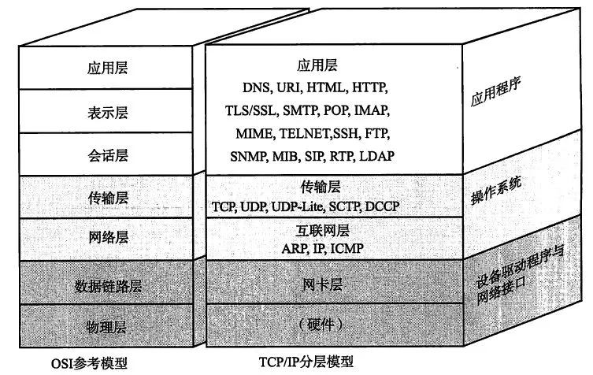
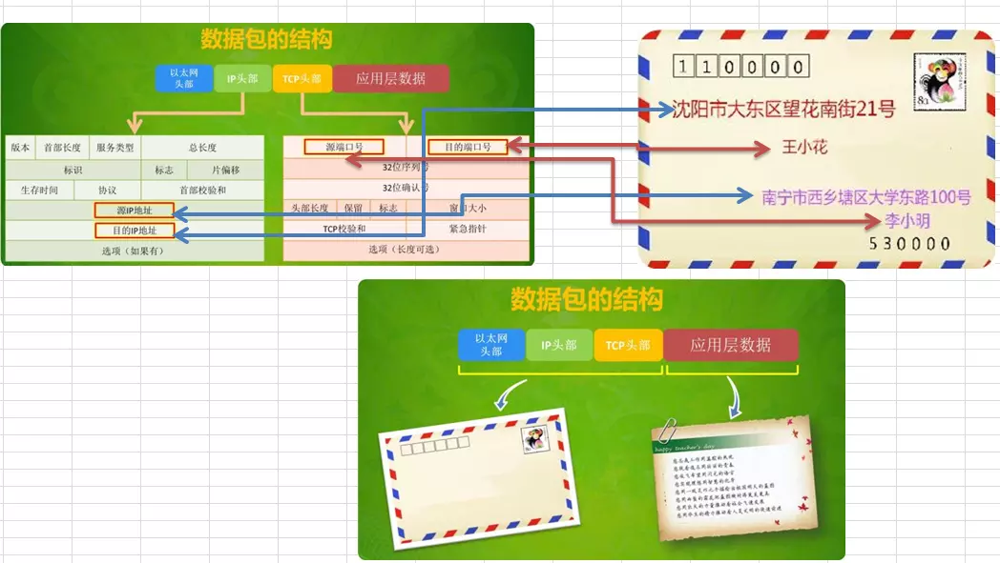
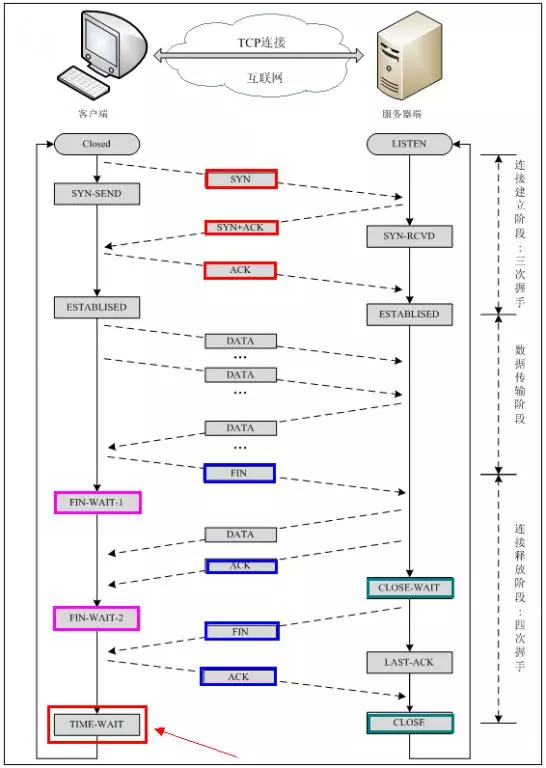

title: tcp.md
date: 2018-06-11 12:00:00
categories: Node
tags: Tcp

---



不同的计算机系统，就好像语言不同的两个人互相见了面，完全不能交流信息。因而他们需要定义一些共通的东西来进行交流，TCP/IP就是为此而生。

封面图中，展示了OSI七层及TCP/IP五层协议的对应关系；

* 网络由下往上分为物理层、数据链路层、网络层、传输层、应用层。

* IP协议对应于网络层，TCP协议对应于传输层，而HTTP协议对应于应用层，三者从本质上来说没有可比性，socket则是对TCP/IP协议的封装和应用（程序员层面上）。

* 也可以说，TPC/IP协议是传输层协议，主要解决数据如何在网络中传输，而HTTP是应用层协议，主要解决 如何包装数据。

## 一张图让你了解TCP/IP到底是啥？



IP能锁定一台物理机器，对应着一张网卡，外界发来的数据包网卡都会接收。如果所有程序都需要监听网卡接发数据，每个包都被发到了所有应用程序，那应用程序符合不了，最后会垮掉，所以就诞生了端口这个标识，从数据安全层面考虑，一个标识号只能被一个应用程序监听。其实网卡都是被系统层封装了，**端口和进程之间的关系也是系统封装好的**。我们只需要用socket就行，给定一个端口号就行了。其它的事都交给操作系统去做。
**TCP读取端口号，这个端口号就是创建socket时注册的，socket创建成功应该有一个process ID，这应该是操作系统来完成的，TCP于是就把[ 端口号  Process ID] 联系了起来，于是就和这个Process ID进程交换，完成数据的发送和接收**。

## TCP

**TCP三次握手四次断开**



1. 三次握手

    1. 第一次握手`主机A`通过一个标识为SYN标识位的数据段发送给主机B`请求连接`，通过该数据段告诉主机B希望建立连接，需要B应答，并告诉主机B传输的起始序列号;
    2. 第二次握手是`主机B`用一个`确认应答`ACK和同步序列号SYNC标志位的数据段来响应主机A，一是发送ACK告诉主机A收到了数据段，二是通知主机A从哪个序列号做标记;
    3. 第三次握手是`主机A确认收到`了主机B的数据段并可以开始传输实际数据。

2. 四次断开

    1. `主机A`发送FIN控制位发出`断开连接的请求`;
    2. `主机B`进行响应，`确认收到断开连接请求`;
    3. `主机B`提出反方向的`关闭要求`;
    4. `主机A确认`收到的主机B的`关闭连接请求`;

问题：为什么断开要四次，而不是三次？
答案：因为主机B在响应收到断开链接请求的同时，还存在未发送完的数据；


## UDP

UDP协议并不提供超时重传，出错重传等功能，所以说其是不可靠的协议。

## TCP与UDP的区别

TCP(Transimision Control Protocal)  ==> http ftp smtp   ==> 电话

* 传输控制协议
* 可靠的、面向连接的协议
* 传输效率低

UDP(User Datagram Protocal)   ==> qq, 微信 ==> 广播

* 用户数据报协议
* 不可靠的、无连接的服务
* 传输效率高


1. TCP是面向链接的，虽然说网络的不安全不稳定特性决定了多少次握手都不能保证连接的可靠性，但TCP的三次握手在最低限度上（实际上也很大程度上保证了）保证了连接的可靠性；而UDP不是面向连接的，UDP传送数据前并不与对方建立连接，对接收到的数据也不发送确认信号，发送端不知道数据是否会正确接收，当然也不用重发，所以说UDP是无连接的、不可靠的一种数据传输协议。

2. 也正由于1所说的特点，使得UDP的开销更小数据传输速率更高，因为不必进行收发数据的确认，所以UDP的实时性更好。

> 知道了TCP和UDP的区别，就不难理解为何采用TCP传输协议的MSN比采用UDP的QQ传输文件慢了，但并不能说QQ的通信是不安全的，因为程序员可以手动对UDP的数据收发进行验证，比如发送方对每个数据包进行编号然后由接收方进行验证啊什么的，即使是这样，UDP因为在底层协议的封装上没有采用类似TCP的“三次握手”而实现了TCP所无法达到的传输效率。

## NodeJS中net模块

* net模块也是node的核心模块，用于底层的网络通信；
* http.server继承了net.server；
* http客户端与http服务端的通信均依赖于socket(net.socket)；

### net模块组成

**主要包含两个部分：**

1. net.server tcp/server，服务端TCP监听来自客户端的请求，并使用TCP连接(socket)向客户端发送数据；内部通过socket来实现与客户端的通信；

2. net.sever tcp/本地，客户端TCP连接到服务器，并与服务器交换数据；socket的node实现，实现了全双工的stream的接口；

**服务端net.Server**

```js
let net = require('net');
let PORT = 8080;
let HOST = 'localhost';
/*
    1. 创建一个TCP服务器实例，调用listen函数开始监听指定端口；
    2. 传入net.createServer()的回调函数，作为connection事件的处理函数；
    3. 在每个connection事件中，该回调函数接收到的socket对象是唯一的；
    4. 该连接自动关联一个socket对象
*/

let server = net.createServer((socket) => {
    console.log('connection:' + socket.remoteAddress, socket.remotePort);
    // 为这个socket实例添加一个“data”事件处理函数
    socket.on('data', (data) => {
        console.log('DATA' + socket.remoteAddress + ':' + data);
        socket.write(data + '\r\n'); // 向客户端回发该数据
    });

    socket.on('end', () => {
        console.log('客户端关闭');
        /*
            服务端收到客户端发出的关闭连接请求时，会触发end事件
            这个时候客户端没有真正的关闭，只是开始关闭
            当真正的关闭的时候，会触发close事件
        */
        server.unref(); // 调用了该方法，则所有的客户端关闭跟本服务器的连接后，将关闭服务器
    });

    // 客户端关闭事件
    socket.on('close', () => {
        console.log('close:' + socket.remoteAddress + '' + socket.remotePort);
    });

    socket.pause();

    socket.setTimeout(3000); // 设置客户端超时时间，如果客户端一直不输入，超过这个时间，就认为超时了

    socket.on('timeout', () => {
        console.log('超时了');
        socket.pipe(ws, {end: false});
        // 默认情况下，当可读流读到末尾的时候回关闭可写流
    });

});

server.listen(PORT, HOST, () => {
    console.log('服务端的地址是：' + server.address());
});

server.on('error', (err) => {
    console.log(err);
});
```

```js
// 服务端也可以通过显示处理“connection”事件来建立TCP连接，只是写法不同，二者没有区别即：
let net = require('net');
let PORT = 8080;
let HOST = 'localhost';

let server = net.createServer();
server.listen(PORT, HOST);
server.on('connection', (socket) => {
    console.log('connection:' + socket.remoteAddress + ':' + socket.remotePort);
});
server.on('close', () => {
    // 关闭服务器，停止接收新的客户端的请求
    console.log('close事件：服务端关闭');
});
server.on('error', (error) => {
    console.log('error事件：服务端异常：' + error.message);
})

```

**客户端net.Server**

```js
let net = require('net');

// 创建一个TCP客户端连接到刚创建的服务器上，该客户端向服务器发送一串消息，并在服务器的反馈后关闭连接

var client = new net.Socket();

let PORT = 8080;
let HOST = 'localhost';

client.connect(PORT, HOST, () => {
    console.log('connect to' + HOST + ':' + PORT);
    client.write('OK'); // 建立连接后立即向服务器发送数据，服务器将受到这些数据
});

client.on('data', (data) => {
    console.log('DATA:' + data);
    client.destroy(); // 完全关闭连接
});

client.on('close', () => {
    console.log('Connection closed');
});

```

### 基于TCP的聊天室

``` js
let net = require('net');
let util = require('util');
let HOST = 'localhost';
let PORT = 8080;
let clients = {};

function broadcast (username, msg) {
    for(let name in clients) {
        if(name != username) {
            clients[name].write(msg + '\r\n');
        }
    }
}

let server = net.createServer((socket) => {
    socket.setEncoding('utf8');
    server.getConnections((err, count) => {
        socket.write('在线人数: ' + count + '\r\n');
        socket.write('请输入昵称: ');
    });

    let username = null;
    socket.on('data', (data) => {
        data = data.replace(/\r\n/, '');
        if(username) {
            broadcast(username, `${username} 说：${data}`);
        } else {
            if(clients[data]) {
                socket.write(data + '该昵称被占用了,请更换\r\n');
            } else {
                username = data;
                clients[username] = socket;
                broadcast(username, `欢迎${username}加入`);
            }
        }
    });
    socket.on('end', () => {
        brodacast(username, `${username}离开聊天室`);
        clients[username] && clients[username].destroy();
        delete clients[username];
    });
});

server.listen(PORT, HOST, () => {
    console.log(`TCP聊天室已启动，地址是${util.inspect(server.address())}`);
});
```

## 附录

---

[来源: 掘金-happyGloria](https://juejin.im/post/5a713d4051882573351a9d72)
[来源](https://zhufengzhufeng.github.io/201802/html/17.tcp.html)