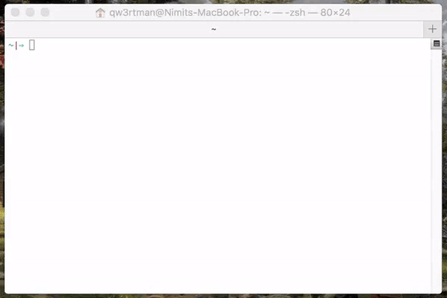

date: 2018-05-22 16:25:00
tags: nodeInstall
categories: Node
---

## 1.Node.js 安装配置

* 偶数位为稳定版本，奇数位为非稳定版本
* 稳定版本中已经发布的API是不会改变的

> **官网**
> https://nodejs.org/
> https://nodejs.org/en/download/

## 2.MAC安装

**homebrew安装**

1. 先安装homebrew http://brew.sh/
2. 在terminal下安装 `homebrew`
3. 通过homebrew安装node.js
`brew install node`
4. 其他软件也都可以通过homebrew安装
`brew install mongodb redis git`


**n模块安装**

切换版本或升级node可以安装 `n` 模块
``` bash
npm install n -g
```

直接输入 `n` 即可上下切换不同的版本



> n ls
> n use xxx

---

[来源](https://zhufengzhufeng.github.io/201802/html/5.nodeInstall.html)
