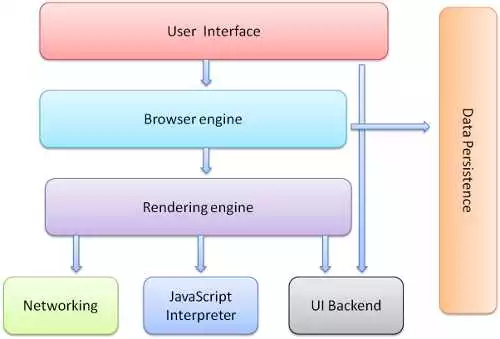

title: Node基础概念&事件环.md
date: 2018-05-21 16:25:00
tags: EventLoop
categories: Node
---

## 1.Node能解决什么问题？

* Node的首要目标是提供一种简单的，用于创建高性能服务器的开发工具
* Web服务器的瓶颈在于并发的用户量，对比java和php的实现方式

**Node** 在处理高并发，I/O密集场景有明显的性能优势

* 高并发，是指在同一时间并发访问服务器
* I/O密集是指文件操作、网络操作、数据库、相对的有CPU密集（CPU密集指的是处理逻辑运算、压缩、解压、加密、解密）

> Web主要场景就是接收客户端的请求读取静态资源和渲染界面，所以Node非常适合Web应用的开发。

## 2.Node是什么？

* Node.js 是一个基于 Chrome V8 引擎的JavaScript 运行环境。Node不是一门语言
* Node.js 使用了一个`事件驱动`、`非阻塞式 I/O` 的模型，使其轻量又高效。
* Node.js 的包管理器 npm，是全球最大的开源生态系统。

## 3.进程与线程

进程是操作系统分配资源和调度任务的基本单位，线程是建立在进程傻姑娘的一次程序运行单位，一个进程上可以有多个线程。

### 3.1 谈谈浏览器

* 用户界面-包括地址栏、前进/后退按钮、书签菜单等
* 浏览器引擎-在用户界面和呈现引擎之间传送指令（浏览器的主进程）
* 渲染引擎，也被称为浏览器内核（浏览器渲染进程）
* 一个插件对应的一个进程（第三方插件进程）
* GPU提高网页浏览器的体验（GPU进程）

> 由此可见浏览器是多进程的，并且从我们的角度来看我们更加关心浏览器渲染引擎

### 3.2 渲染引擎

浏览器渲染引擎内部是多线程的，内部包含两个最为重要的线程：UI线程和JS线程。这里要特别注意UI线程和JS线程是互斥的，因此JS运行结果会影响到UI线程的结果。UI更新会被保存在队列中等到JS线程空闲时立即被执行。

### 3.3 js单线程

JavaScript在最初设计时设计成单线程，为什么不是多线程呢？

如果多个线程同时操作DOM，那岂不会很混乱？这里所谓的单线程指的是主线程是单线程的，所以在Node中主线程依旧是单线程的。

### 3.4 其他线程

* 浏览器事件触发线程（用来控制事件循环，存放setTimeout、浏览器事件、ajax的回调函数）
* 定时触发器线程（setTimeout定时器所在线程）
* 异步HTTP请求线程（ajax请求线程）

> 单线程特点是节约了内存，并且不需要再切换执行上下文。而且单线程不需要管锁的问题，这里简单说下锁的概念。
> 例如：下课了大家都去上厕所，厕所就一个，相当于所有人都要访问同一个资源。那么先进去的就要上锁。而对于来说，下课了就一个人去厕所，所以免除了锁的问题。
>

## 4 浏览器中的Event Loop

1. 所有同步任务都在主线程上执行，形成了一个执行栈
2. 主线程之外，还存在一个任务队列。只要异步任务有了运行结果，就在任务队列之中放置一个事件。
3. 一旦执行栈中的所有同步任务执行完毕，系统就会读取任务队列，将队列中的事件放到执行栈中依次执行
4. 主线程从任务队列中读取事件，这个过程是循环不断的

> 整个的种种运行机制又称为 Event Loop（事件循环）

## 5 Node系统

我们先来张图看看Node是如何工作的

主线程从 **任务队列** 中读取事件，这个过程总循环不断的，所以整个的这种运行机制又称为EventLoop(事件循环)

**Node.js的Event Loop**

1. 我们写的js代码会交给v8引擎进行处理
2. 解析后的代码，调用Node API，node会交给libuv库处理
3. libuv库负责Node API的执行。它将不同的任务分配给不同的线程，形成一个EventLoop（事件循环），以异步的方式将任务的执行结果返回给V8引擎。
4. 通过事件驱动的方式，将结果放到事件队列中，V8引擎再将结果返回给用户

### 3.1 为什么JavaScript是单线程？

* 这是由 JavaScript 这门脚本语言的用途决定的。
* Web Worker 并没有改变 JavaScript 单线程的本质

### 3.4 任务队列

1. 所有同步任务都在主线程上执行，形成一个执行栈。
2. 主线程之外，还存在一个任务队列。只要异步任务有了运行结果，就在任务队列之中放置一个事件。
3. 一旦执行栈中的所有 **同步任务** 执行完毕，系统就会读取 **任务队列**，看看里面有哪些事件。那些对应的异步任务，于是结束等待状态，进入执行栈，开始执行。
4. 主线程不断重复上面的第三步。

## 6 同步与异步

同步和异步关注的是消息通知机制

* 同步就是发出调用后，没有得到结果之前，该调用不返回，一旦调用返回，就得到返回值了。简而言之就是调用者主动等待这个调用结果
* 而异步则相反，调用者在发出调用后这个调用就直接返回了，所以没有返回结果。换句话说当一个异步过程调用发出后，调用者不会立刻得到结果，而是调用发出后，被调用者通过状态、通知或者回调函数处理这个调用。

## 7 阻塞与非阻塞

阻塞和非阻塞关注的是程序在等待调用结果（消息、返回值）时的状态

* 阻塞调用是指调用结果返回之前，当前线程会被挂起。调用线程只有在得到结果之后才会返回。
* 非阻塞调用指在不能立刻得到结果之前，该调用不会阻塞当前线程。

## 8 组合

同步异步取决于被调用者，阻塞非阻塞取决于调用者

* 同步阻塞
* 异步阻塞
* 同步非阻塞
* 异步非阻塞

## 9 宏任务和微任务

任务可分为宏任务和微任务

* macro-task(宏任务): setTimeout、setInterval、setImmediate、I/O
* micro-task(微任务): process.nextTick、原生Promise(有些实现的promise将then方法放到了宏任务中)、Object.observe(已废弃)、MutationObserver

## 10 什么场合下应该考虑使用Node框架

当应用程序需要处理大量并发的输入输出，而在向客户端响应之前，应用程序并不需要进行非常复杂的处理。

* 聊天服务器
* 电子商务网站
